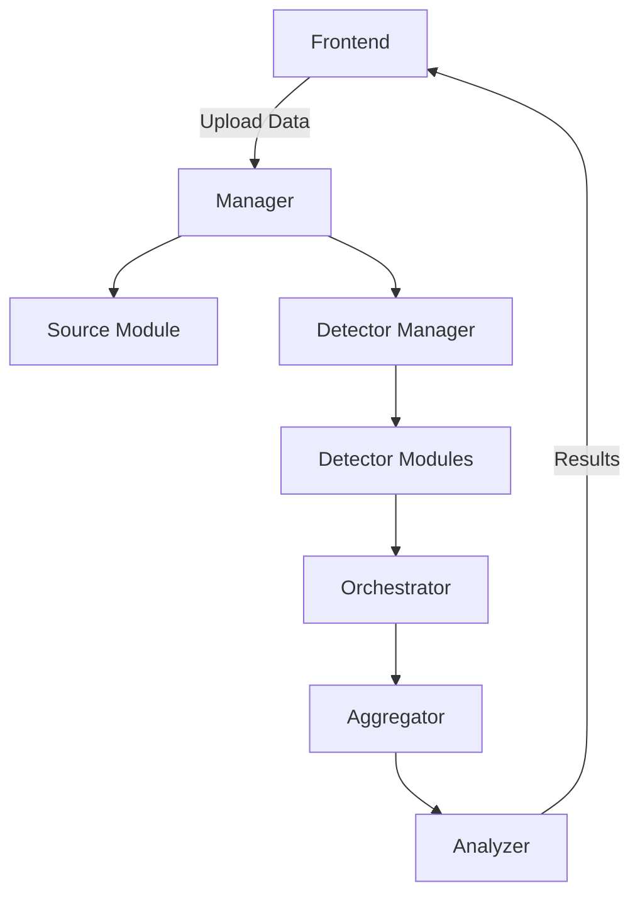
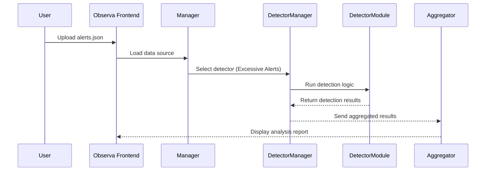

# 🧠 **Observa: A Framework for Observability Antipattern Detection and Analysis**

> **Observa** is a modular and extensible framework designed to detect and analyze **observability antipatterns** in distributed systems.  
> It provides a unified environment for loading observability data (metrics, logs, and traces), executing custom detection algorithms, and aggregating analytical results to support maintainability and performance improvements.

---

## 🚀 **Overview**

Modern distributed systems rely on observability to understand runtime behavior.  
However, **poor observability practices** — such as excessive alerting, missing trace correlations, or redundant metrics — can introduce **observability antipatterns**, reducing monitoring efficiency and maintainability.

**Observa** helps identify such issues by providing:
- A **flexible plugin-based architecture** for antipattern detection;
- A **unified data interface** for observability inputs;
- An **execution and orchestration layer** to manage detectors;
- **Visualization and aggregation modules** for comprehensive analysis.

---

## 🧩 **Architecture**



| Component | Description |
|------------|-------------|
| **Manager** | Configures and coordinates framework modules. |
| **Source Module** | Loads observability data (metrics, logs, traces). |
| **Detector Manager** | Registers and maps detectors to datasets. |
| **Detector Modules** | Implement detection logic for specific antipatterns. |
| **Orchestrator** | Executes detectors, collects runtime and result metrics. |
| **Aggregator** | Summarizes and unifies results from multiple detectors. |
| **Frontend** | Web-based UI for configuration and visualization. |

---

## ⚙️ **Installation**

### Requirements
- **Python 3.11+**
- Optional: `streamlit`, `fastapi`, `flask` (for the frontend)

### Setup

```bash
# Clone the repository
git clone https://github.com/youruser/observa.git
cd observa

# Create a virtual environment
python -m venv venv
source venv/bin/activate  # Linux/Mac
venv\Scripts\activate     # Windows

# Install dependencies
pip install -r requirements.txt
```

---

## ⚡ **Quick Start**

### 1. Add a Data Source
```bash
observa source add --type metrics --file metrics.json
```

### 2. Register a Detector
```bash
observa detector register detectors/excessive_alerts_detector.py
```

### 3. Run the Detection
```bash
observa run --detector excessive_alerts_detector
```

### 4. Generate Report
```bash
observa report --format json
```

---

## 🧩 **Creating a Custom Detector**

You can easily define your own detector by implementing the `Detector` interface.

### Example: `excessive_alerts_detector.py`

```python
from observa.core import Detector

class ExcessiveAlertsDetector(Detector):
    def detect(self, data):
        threshold = 100
        excessive = [a for a in data if a.get("count", 0) > threshold]
        
        return {
            "antipattern": "Excessive Alerts",
            "instances": len(excessive),
            "details": excessive
        }
```

Then, register and execute it:

```python
from observa import ObservaFramework
from detectors.excessive_alerts_detector import ExcessiveAlertsDetector

observa = ObservaFramework()
observa.register_detector(ExcessiveAlertsDetector())

data = observa.load_source("data/alerts.json")
results = observa.run_all(data)

print(results)
```

---

## 🧾 **Example Dataset**

File: `alerts.json`
```json
[
  { "alert_name": "HighCPUUsage", "count": 132 },
  { "alert_name": "MemoryLeakWarning", "count": 44 },
  { "alert_name": "DatabaseConnectionError", "count": 205 },
  { "alert_name": "DiskFullWarning", "count": 12 }
]
```

---

## 📊 **Expected Output**

```json
{
  "detector": "Excessive Alerts",
  "instances": 2,
  "details": [
    { "alert_name": "HighCPUUsage", "count": 132 },
    { "alert_name": "DatabaseConnectionError", "count": 205 }
  ],
  "execution_time_ms": 7.1
}
```

---

## 🧪 **Example Workflow**



---

## 🧰 **Tech Stack**
- **Language:** Python 3.11+  
- **Frontend:** Streamlit (default) or FastAPI + React  
- **Data Formats:** JSON, CSV, OTLP  
- **Integrations:** Prometheus, OpenTelemetry Collector, Jaeger  

---

## 🧮 **Performance Metrics**
The framework automatically collects:
- Execution time per detector  
- Dataset size and processing latency  
- Total detected instances per antipattern  

Metrics can be exported to Prometheus or visualized directly on the frontend.

---

## 🧭 **Roadmap**
- [ ] Additional detectors: *Missing Traces*, *Redundant Metrics*, *Inefficient Logging*  
- [ ] Real-time OTLP data ingestion  
- [ ] Web dashboard with detector comparison view  
- [ ] Plugin system for third-party detectors  
- [ ] Integration with Grafana  

---

## 🧑‍💻 **Frontend**
```bash
streamlit run frontend/app.py
```

---

## 🤝 **Contributing**
1. Fork this repository  
2. Create a new branch: `git checkout -b feature/my-detector`  
3. Implement your detector and tests  
4. Submit a pull request 🚀  

---

## 📚 **Citation**
```bibtex
@misc{observa2025,
  title  = {Observa: A Framework for Observability Antipattern Detection and Analysis},
  author = {Your Name},
  year   = {2025},
  note   = {Available at: https://github.com/youruser/observa}
}
```

---

## 🧾 **License**
MIT License © 2025 Your Name  
See `LICENSE` for more details.

---

## 🌐 **Project Links**
- **Repository:** [https://github.com/youruser/observa](https://github.com/youruser/observa)
- **Documentation:** (coming soon)
- **Contact:** your.email@domain.com
