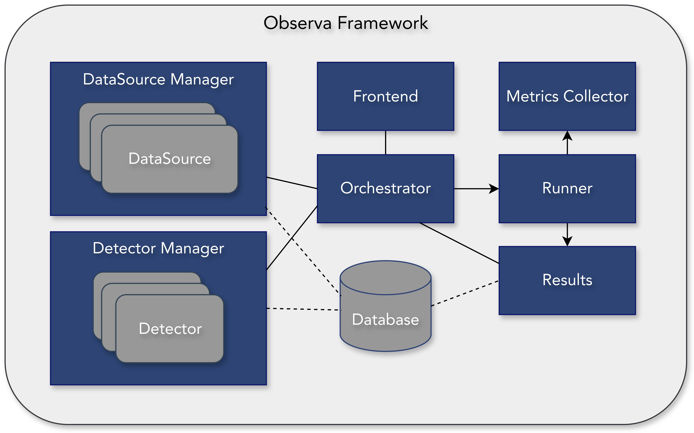

# Observa Framework

O **Observa** é um framework projetado para apoiar a detecção automática de **anti-padrões de observabilidade** em aplicações distribuídas. Diferentemente das ferramentas convencionais de observabilidade — tradicionalmente voltadas à coleta, visualização e correlação de sinais — o Observa tem como foco avaliar a **qualidade da observabilidade efetivamente implementada**, identificando más práticas associadas ao uso de métricas, *logs*, *traces*, alertas e *dashboards*.

Para isso, o framework integra fontes heterogêneas de dados de telemetria e emprega **detectores especializados**, cada um responsável por analisar evidências de um AP específico.

---

## Arquitetura

A figura abaixo apresenta a visão geral da arquitetura do Observa Framework, evidenciando seus principais módulos e as interações entre eles. A arquitetura é organizada de forma **modular**, com clara separação de responsabilidades, o que permite maior controle sobre o processo de análise e favorece a extensibilidade do *framework*.

> **Nota:** substitua o caminho da imagem conforme a organização do repositório.



- Figura 1: Arquitetura do Observa


- Figura 2: Visão Geral dos Resultados da Detecção de Alertas Excessivos


- Figura 3: Detalhes de Alertas Detectados como Excessivos


- Figura 4: Detalhes de Alertas não Detectados como Excessivos

Componentes da Arquitetura

A arquitetura do Observa é composta pelos seguintes componentes:

Orchestrator

Runner

DataSource Manager

DataSource

Detector Manager

Detector

Metrics Collector

Results

Database

Frontend

A seguir, descreve-se o papel de cada componente.

Orchestrator

O Orchestrator é o componente central da arquitetura e responsável por coordenar o fluxo de execução do Observa Framework. Ele atua como o núcleo de controle lógico do sistema, recebendo as interações dos usuários por meio do Frontend e iniciando o funcionamento dos demais módulos.

DataSource Manager

O DataSource Manager é responsável por gerenciar as fontes de dados utilizadas no framework, representadas pelo componente DataSource, bem como manter o registro das fontes disponíveis. Esse componente é acionado pelo Orchestrator.

DataSource

O DataSource representa uma fonte concreta de dados de observabilidade integrada ao Observa. Esse componente encapsula a lógica específica de acesso a uma determinada fonte, como métricas, traces ou logs, sendo responsável pela coleta e preparação dos dados para análise. Essa abstração desacopla os mecanismos de coleta do restante da arquitetura, favorecendo a extensibilidade do framework.

Detector Manager

O Detector Manager é responsável por gerenciar o conjunto de detectores disponíveis no framework. Ele seleciona e organiza os detectores que devem ser executados com base nos DataSources e no objetivo da análise. Esse componente também é acionado pelo Orchestrator.

Detector

O Detector é o componente encarregado da análise dos dados de observabilidade. Cada detector implementa uma lógica específica de detecção voltada à identificação de anti-padrões. Esses detectores constituem o núcleo analítico do Observa e podem empregar heurísticas baseadas em regras ou estratégias fundamentadas na literatura.

Runner

O Runner é responsável pela execução efetiva das detecções definidas pelo usuário. Ele materializa o plano de execução estabelecido, realizando a coleta de dados, o acionamento dos detectores e a persistência dos resultados.

A separação entre coordenação e execução contribui para uma arquitetura mais flexível e extensível. No Observa, estão implementadas duas estratégias de execução:

Simples: a coleta de dados e a detecção são realizadas uma única vez;

Periódica: coletas recorrentes são realizadas em intervalos de tempo definidos, acumulando dados ao longo do período de observação e executando a detecção posteriormente.

Results

O componente Results representa as saídas finais do processo de análise realizado pelo Observa. Ele consolida os achados produzidos pelos detectores, como a identificação de anti-padrões e as razões dessa detecção nos dados enviados pelos DataSources. Os resultados podem ser encaminhados ao Frontend para visualização e avaliação.

Metrics Collector

O Metrics Collector é responsável pela coleta de métricas relacionadas às execuções do Observa. Atualmente, a métrica coletada é o tempo de execução das detecções, permitindo análises quantitativas do comportamento do framework.

Database

O Database é responsável pela persistência dos dados coletados e dos resultados gerados pelo framework. Esse componente garante o armazenamento estruturado das informações, possibilitando análises posteriores, comparações entre diferentes execuções e a reprodutibilidade dos experimentos.

Frontend

O Frontend é o componente dedicado à interação do usuário com o Observa, atuando como a camada de apresentação do framework. Por meio dele, é possível:

Gerenciar DataSources e Detectors;

Configurar novas fontes de dados e detectores;

Disparar análises de anti-padrões;

Visualizar resultados e histórico de execuções.

Princípios de Design

O desenvolvimento do Observa foi orientado por princípios arquiteturais que garantem robustez, extensibilidade e alinhamento com objetivos científicos e práticos.

Modularidade e Separação de Preocupações

Responsabilidades como coleta de dados, análise de anti-padrões, execução e persistência são tratadas de forma independente. Essa separação reduz o acoplamento entre componentes, favorece a clareza arquitetural e permite a evolução incremental do framework.

Extensibilidade Orientada a Anti-padrões

A arquitetura foi concebida para permitir a incorporação progressiva de novos anti-padrões, fontes de dados e estratégias de detecção. Cada AP é tratado como uma unidade analítica autônoma, encapsulada em detectores independentes.

Independência Tecnológica

A interação com métricas, logs, traces e alertas ocorre por meio de abstrações padronizadas, garantindo compatibilidade com diferentes ferramentas e ecossistemas de observabilidade e preservando a neutralidade tecnológica da solução.

Reprodutibilidade Experimental

A arquitetura do Observa suporta execuções controladas e repetíveis, permitindo que a detecção de APs produza resultados consistentes independentemente do ambiente de execução. Esse princípio é essencial para a validade experimental de estudos empíricos.

Transparência e Rastreabilidade

Todas as etapas do processo analítico — fontes utilizadas, detectores selecionados, resultados obtidos e metadados de execução — são explicitamente registradas. Isso garante auditabilidade, possibilita análises retrospectivas e sustenta estudos longitudinais.

Detalhes de Implementação

O Observa foi desenvolvido em Python, com ambiente conteinerizado via Docker para garantir replicabilidade. A base arquitetural utiliza FastAPI para construção das APIs, sendo executado com Uvicorn.

Para persistência, o framework utiliza SQLAlchemy com banco de dados PostgreSQL, acessado via psycopg2-binary. A validação e o transporte de dados são definidos com Pydantic.

# Observa: Framework para Detecção Automática de Anti-padrões de Observabilidade


O **Observa** é um framework desenvolvido para facilitar a detecção automática de anti-padrões de observabilidade pelos usuários. Os anti-padrões foram previamente catalogados e podem ser visualizados em:  
https://observability-antipatterns.github.io/

O framework atua como intermediário entre fontes de dados e detectores de anti-padrões. Por meio do Observa, é possível criar qualquer tipo de fonte de dados, desde que estruturada em formato JSON, como dados de alertas, logs, traces, dashboards, entre outros.

Um vídeo foi criado para facilitar o entendimento prático do framework:  
https://www.youtube.com/watch?v=

## Fontes de Dados

Na configuração das fontes de dados, existem duas possibilidades:

1. Criar uma nova fonte de dados manualmente, em um arquivo JSON;  
2. Adicionar uma fonte de dados existente, vinculando-a por meio de uma API.

No primeiro caso, tratam-se de dados **estáticos**, portanto o detector sempre produzirá a mesma resposta ao analisá-los.  
No segundo caso, como a fonte está vinculada a uma API, o endpoint pode fornecer dados **dinâmicos**. Como pré-requisito, essa API deve disponibilizar os dados via requisição **GET**.

Independentemente da origem, uma vez obtidos os dados, o Observa os envia ao **detector** selecionado pelo usuário.

Cada detector deve ser uma **API** capaz de:
- Receber um JSON via método **POST**;
- Retornar uma resposta também em formato **JSON**, seguindo a estrutura abaixo.

```json
{
  "analyzed": 10,
  "detected": 4,
  "data": []
}
