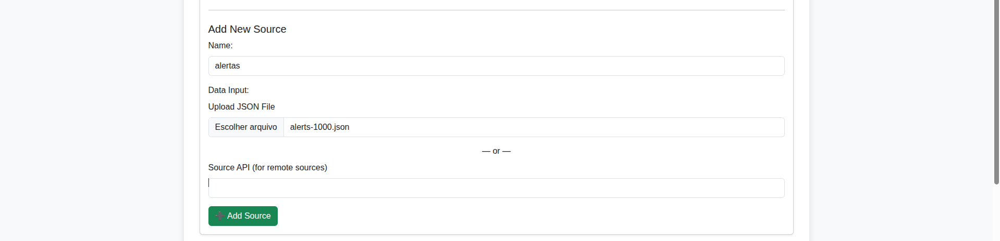
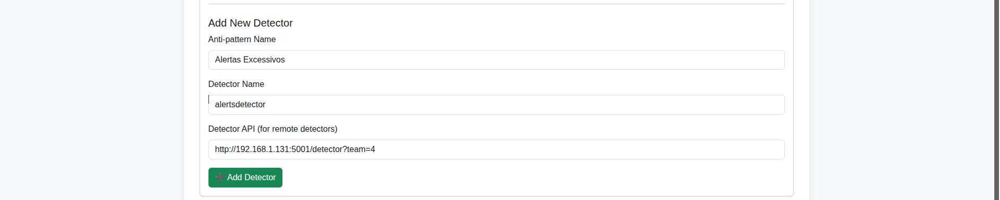
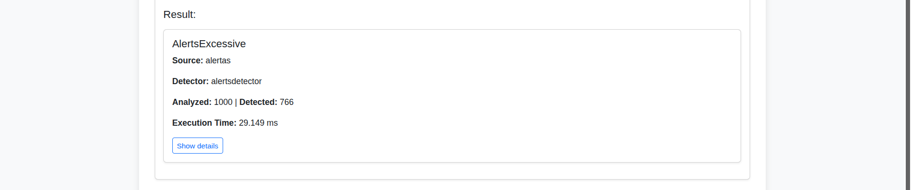
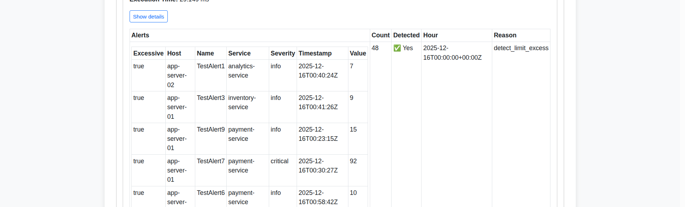
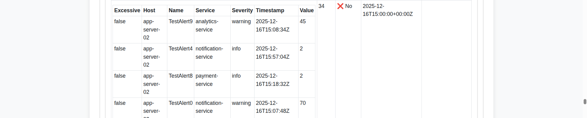
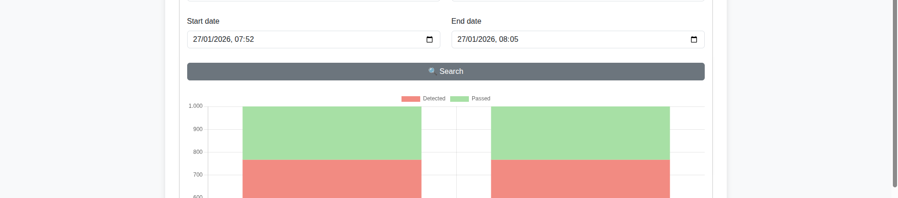

# Observa Framework

O Observa é um framework para detecção automática de anti-padrões de observabilidade em aplicações distribuídas. Seu objetivo é avaliar a qualidade da observabilidade implementada a partir da análise de dados de telemetria, como métricas, logs, traces, alertas e dashboards. O framework integra diferentes fontes de dados e executa detectores especializados, sendo cada detector responsável por identificar um anti-padrão específico.

Um catálogo de anti-padrões de observabilidade está disponível em: https://observability-antipatterns.github.io/

---

## Instalação

Para facilitar a instalação do Observa, foi utilizado o Docker, o qual oferece isolamento completo e facilita o deployment em diferentes ambientes.

**Pré-Requisitos**

- Docker
- Docker Compose

**Passo 1:** Clone o repositório:

```
git clone https://github.com/andersonalmada/detect-antipatterns.git
cd detect-antipatterns
```

**Passo 2:** Execute o docker compose:

```
cd docker
docker compose up -d
```

## Execução

Uma vez iniciado os contêineres, o Observa é gerenciado de forma gráfica por meio do navegador na porta 8000:

```
http://localhost:8000
```

Caso queira encerrar o Observa, execute o seguinte comando:

```
docker compose down
```

## Prova de Conceito

Para demonstrar o Observa, é realizado a execução das principais funcionalidades, como adicionar as fontes de dados, adicionar detectores dos APs, realizar a detecção, visualizar os resultados e históricos das detecções. Nesse exemplo, são utilizados os dados de alertas como fontes de dados e realizado a detecção de APs de Alertas Excessivos.

**Passo 1:** Uma vez executado o Observa, adicione uma nova fonte de dados. Para isso, escolha o dataset contendo 1000 alertas que está na pasta alerts, dê um nome para fonte de dados e clique em *Add Source*.



**Passo 2:** Inicie o detector de alertas excessivos. Ele é um serviço python que executa na pasta *5001* e tem uma rota chamada *detector* para detecção do anti-padrão. Para isso, entre na pasta alerts/docker, e execute o seguinte comando:

```
docker compose up -d --build
```

**Passo 3:** Para adicionar o detector no Observa, é necessário saber o ip da máquina, para recuperar onde está o serviço do detector. Se linux, execute o seguinte comando:

```
ifconfig
```

No meu caso, o retorno foi *192.168.1.131*.

**Passo 4:** No Observa, configure o detector por meio do nome do anti-padrão, nome do detector e endereço do detector e, posteriormente, clique em *Add Detector*. Nessa poc, como dito anteriormente, o detector é um serviço que executa na porta *5001* e tem rota *detector* para detecção do do anti-padrão. Um parâmetro que pode ser passado é a quantidade de operadores do time de observabilidade responsável pelos alertas (*team*, o valor padrão é 1). Outro parâmetro é a quantidade de alertas que cada operador consegue tratar por hora trabalhada (*limit*, o valor padrão é 10). Nota: Esse valor de limite de referência é retirado do seguinte link: https://www.suprsend.com/post/alert-fatigue



**Passo 5:** Após adiciona fonte de dados e detector, o próximo passo é a execução. Clique na aba *Detection*. Para a poc, foi escolhido o modo direto, apenas uma execução, sem ser de maneira periódica, pois os dados são estáticos e não teria alteração do resultado. Clique em *Run Detector*

**Passo 6:** Verifique o resultado. É possível ver a quantidade de alertas (1000) e a quantidade de elementos que foram detectados como excessivos (766).



**Passo 7:** Caso queira mais detalhes, clique em *Show details*. É possível verificar o casos que são excessivos e os que não são excessivos.





**Passo 8:** Caso queira visualizar o histórico das execuções, clique na aba *History*. Escolha a fonte de dados, o detector e o período do histórico e clique em *Search*. Você vai visualizar todas as execuções, em formato de barra vertical, e pode verificar os detalhes de cada uma delas, clicando na barra.



## Licença

Este projeto está licenciado sob a Apache License, Version 2.0.

Você pode usar, modificar e distribuir este software, inclusive para fins comerciais,
desde que mantenha os avisos de copyright e licença.

### Apache License 2.0

Copyright (c) 2026 Francisco Anderson de Almada Gomes

Licensed under the Apache License, Version 2.0 (the "License");
you may not use this file except in compliance with the License.
You may obtain a copy of the License at:

    http://www.apache.org/licenses/LICENSE-2.0

Unless required by applicable law or agreed to in writing, software
distributed under the License is distributed on an "AS IS" BASIS,
WITHOUT WARRANTIES OR CONDITIONS OF ANY KIND, either express or implied.
See the License for the specific language governing permissions and
limitations under the License.
